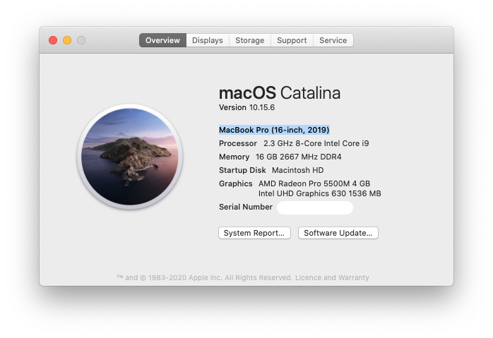
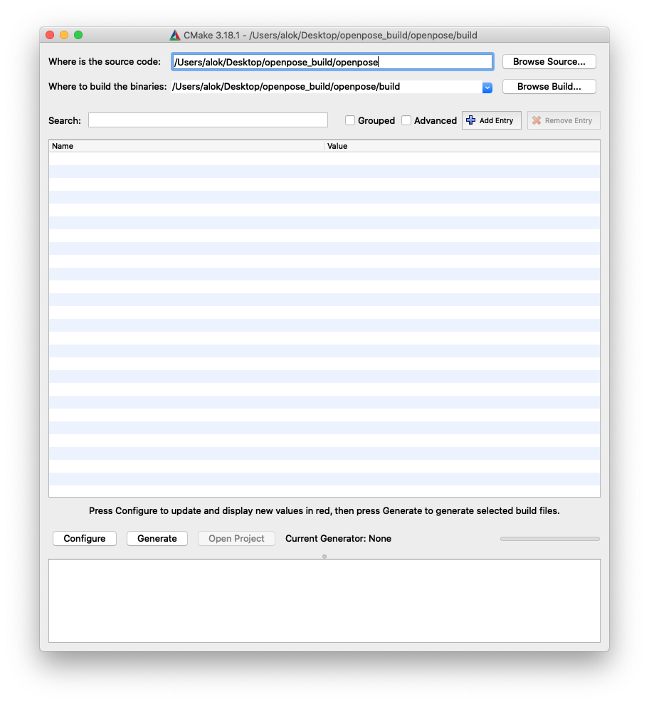
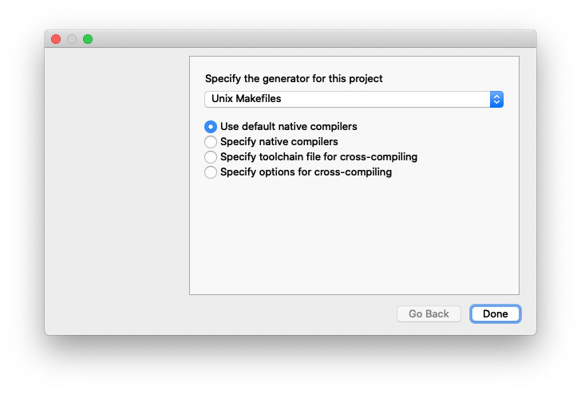
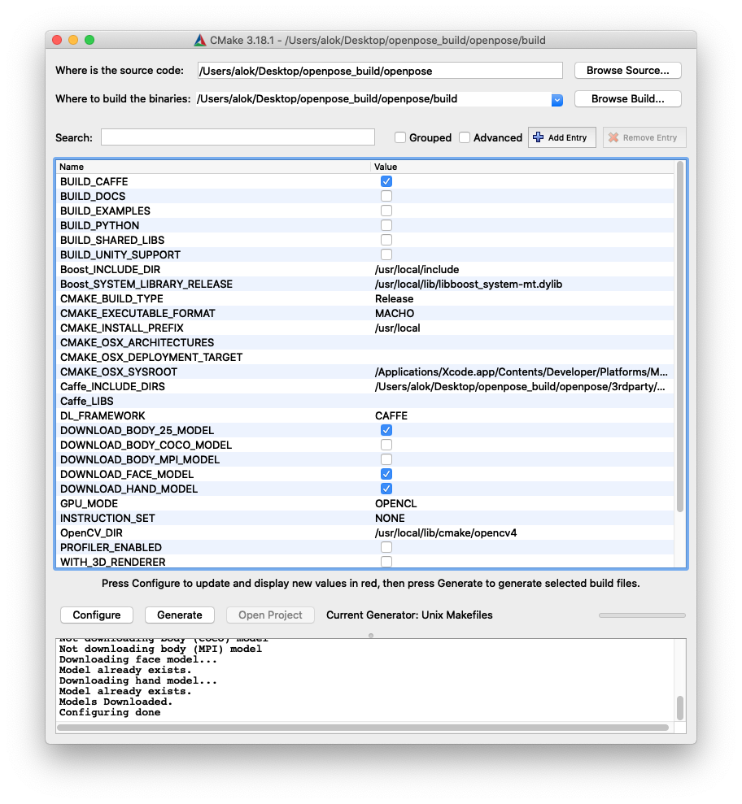
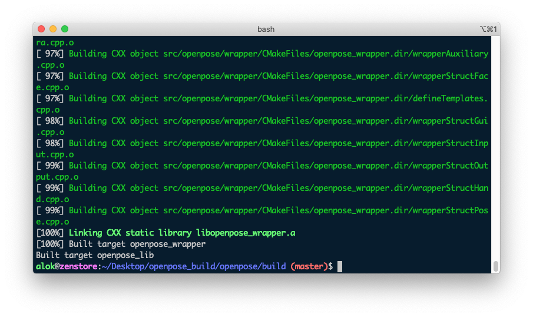
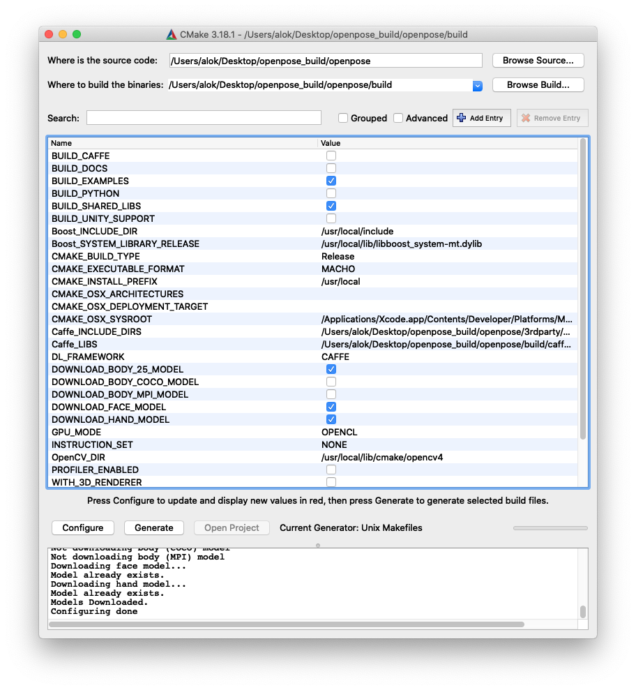

# Build openpose with/without GPU support for macOS (Catalina 10.15.6)

Building openpose for macOS can be quite challenging given the sheer number of dependencies and build steps. Although the official [docs](https://github.com/CMU-Perceptual-Computing-Lab/openpose) are comprehensive and cover almost everything, it would still be nice to have a step by step procedure that covers all issues and gotchas. With this objective, the following is an easy-to-follow and clean build process.

- [Before you begin](#notes)
  - [Prerequisites](#prerequisites)
  - [Step order is important](#steporder)
  - [Building without GPU support](#nongpu)
  - [A word about build environment (hardware and software)](#specs)
- [Part A: Get the source code and dependencies](#partb)
  - [Step 1: Clone repository](#clonerepo)
  - [Step 2: Install dependencies](#installdeps)
- [Part B - Build caffe](#parta)
  - [Step 3: Config build settings for caffe](#configcaffe)
  - [Step 4: Manually generate headers](#headers)
  - [Step 5: Apply patch to caffe for opencl support (required for GPU mode only)](#patch)
  - [Step 6: Build caffe](#buildcaffe)
- [Part C - Build examples and shared libs](#partc)
  - [Step 7: Config build setting for examples and shared libs](#configexamples)
  - [Step 8: Finally build examples and shared libs](#buildshared)
  - [Run examples and test](#run)

## <a name="notes"></a>Before you Begin

- ### <a name="prerequisites"></a> Prerequisites

  You should have the following on your mac
  - [Xcode](https://apps.apple.com/us/app/xcode/id497799835?mt=12)
  - [CMake GUI](https://cmake.org/)
  - [brew](#brew)

- ### <a name="steporder"></a>Step order is important

    For a successful build, please follow all the steps in exactly the same order as described below. If you miss or reorder any of the steps this might not work. I have spent a considerable amount of time in painfully figuring this out after significant trial and error.

- ### <a name="nongpu"></a>Building without GPU support

    If you do not have a GPU on your machine, you can still build openpose without GPU support by making the following changes:

  - In Step 3 below, set GPU_MODE = __CPU_ONLY__
  - Completely skip Step 5 for applying a patch for GPU build

- ### <a name="specs"></a>A word about build environment (hardware and software)

    Do note that this has been tested on a Mac Book Pro with macOS (Catalina 10.15.6). Other MacBooks / macOS versions are not tested but in all probability, this should still work. Below are the specs on which the build was tested



## <a name="parta"></a>Part A - Get the source code and dependencies

First we will pull the source code cloning the official openpose github repo and also install all the required dependencies.

- ### <a name="clonerepo"></a>Step 1: Clone repository

    Create a new folder where you want to build openpose

    ```bash
    mkdir openpose_build

    cd openpose_build

    git clone --recursive git@github.com:CMU-Perceptual-Computing-Lab/openpose.git

    cd openpose
    ```

    Let's call this cloned repo folder "__\<root path\>__" for the rest of this doc.

    >**Note**: The **_\`--recusive\`_** flag, it makes sure that all the sub-modules (caffe, pybind, etc. are cloned as well)

- ### <a name="installdeps"></a>Step 2: Install dependencies

    ```bash
    <root path>/scripts/osx/install_deps.sh
    ```

    >**Note(optional)**: In addition to adding libs from brew, __install_deps.sh__ also adds some python packages. If you see an error in installing __opencv-python__, edit __install_deps.sh__
    >change the line

    `sudo pip install opencv-python`

    >to

    `sudo pip install opencv-contrib-python`

    and run again.

    ><a name="brew"></a>>**Note(optional)**: Just in case you do not have brew on your machine, you can install brew by running

    ```bash
    <root path>/scripts/osx/install_brew.sh
    ```

    or you can install from the official [source](https://brew.sh/)

## <a name="partb"></a>Part B - Build caffe

Next, we will build [Caffe](https://github.com/BVLC/caffe) which is a major dependency of openpose lib. The CMU Perceptual Lab team has worked on a fork of caffe and included this as a submodule in the openpose git repo. Per the official docs -
>Caffe is a deep learning framework made with expression, speed, and modularity in mind. It is developed by Berkeley AI Research ([BAIR](http://bair.berkeley.edu/))/The Berkeley Vision and Learning Center (BVLC) and community contributors.

- ### <a name="configcaffe"></a>Step 3: Config build settings for caffe

    Now we will config our build settings for building caffe libs

  - Open CMake GUI

    ```bash
    cmake-gui
    ```

    - Set the project and build paths

    - Where is the source code = __\<root path\>__
    - Where to build the binaries = __\<root path\>/build__

    

    - Click on __Configure__

    - Click __Yes__ for creating the build folder (in case you have not already created). This will create the initial config and download all the remaining necessary files.

    - In the next dialog, do not change any settings. Defaults are good - Generator is `Unix Makefiles` and `Use default native compilers`. Click Done

    

    - After the download finishes, build settings will be displayed with some items colored in red. Make the following changes to the build settings in the UI

      - [x] BUILD_CAFFE
      - [ ] BUILD_EXAMPLES
      - [ ] BUILD_SHARED_LIBS
      - Caffe_INCLUDE_DIRS = __\<root path\>/build/caffe/include__
      - GPU_MODE = __OPENCL__
      - Leave the rest of the settings to default

    

    - Click __Configure__ a few times until all the red color items are gone. The log will show: _Configuring done_

    - Click __Generate__. The log will show: _Generating done_

    - We are ready to build caffe now

    >**Note**: Keep the CMake GUI open, we will use this for the further build process.

- ### <a name="headers"></a>Step 4: Manually generate headers

    Generate the missing caffe.pb.h header file for proto

    ```bash
    protoc <root path>/3rdparty/caffe/src/caffe/proto/caffe.proto --cpp_out=.

    mkdir <root path>/3rdparty/caffe/include/caffe/proto

    mv <root path>/3rdparty/caffe/src/caffe/proto/caffe.pb.h <root path>/3rdparty/caffe/include/caffe/proto
    ```

    See [this issue](https://github.com/CMU-Perceptual-Computing-Lab/openpose/issues/677) for more details.

- ### <a name="patch"></a>Step 5: Apply patch to caffe for opencl support (required for GPU mode only)

    This fixes:
    Fatal error: 'opencv2/highgui/highgui.hpp' file not found (details [here](https://github.com/CMU-Perceptual-Computing-Lab/openpose/issues/1228#issuecomment-494433914))

    ```bash
    cd <root path>/3rdparty/caffe

    git apply ../../scripts/osx/mac_opencl_patch.txt
    ```

- ### <a name="buildcaffe"></a>Step 6: Build caffe

    ```bash
    cd <root path>/build

    make -j`sysctl -n hw.logicalcpu`
    ```

    Wait for the build to finish. Hopefully, without errors, warnings are ok. You should see the following in the terminal

    

## <a name="partc"></a>Part C - Build examples and shared libs

- ### <a name="configexamples"></a>Step 7: Config build setting for examples and shared libs

  - Make the following changes to the build settings in the already open CMake GUI app from __Step 3__ above

    - [ ] BUILD_CAFFE
    - [x] BUILD_EXAMPLES
    - [x] BUILD_SHARED_LIBS
    - Caffe_LIBS = __\<root path\>/build/caffe/lib/libcaffe.dylib__
    - Leave the rest of the settings to default

  

  - Click __Configure__ again. The log will show: _Configuring done_

  - Click __Generate__. The log will show: _Generating done_

  - We are ready to finally build openpose libs and executable binaries now

- ### <a name="buildshared"></a>Step 8: Finally build examples and shared libs

    ```bash
    cd <root path>/build

    make -j`sysctl -n hw.logicalcpu`
    ```

    Hopefully, this should finally build everything

## <a name="run"></a>Run examples and test

Detailed instructions for running demos can be found [here](https://github.com/CMU-Perceptual-Computing-Lab/openpose#quick-start) on the official docs.

- Process video

    ```bash
    <root path>/build/examples/openpose/openpose.bin --video examples/media/video.avi
    ```

- Running openpose on live camera feed (with GPU)

  ```bash
  <root path>/build/examples/openpose/openpose.bin --num_gpu 1 --num_gpu_start 2
  ```

Enjoy!
